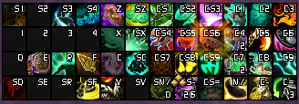
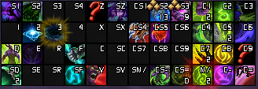

# XoneFobic's Currated list of World of Warcraft Addons, Weakauras, Settings and other things.

# Addons

| Name + Link | Description |
| --- | --- |
| [Advanced Interface Options](https://www.curseforge.com/wow/addons/advancedinterfaceoptions) | It says it on the label |
| [Astral Keys](https://www.curseforge.com/wow/addons/astral-keys) | Helps communcation around setting up a mythic+ group |
| [BetterBags](https://www.curseforge.com/wow/addons/better-bags) | Alternate bags addon |
| [Deadly Boss Mods (DBM)](https://www.curseforge.com/wow/addons/deadly-boss-mods) / [BigWigs](https://www.curseforge.com/wow/addons/big-wigs) + [LittleWigs](https://www.curseforge.com/wow/addons/little-wigs) | Helps with timers during encounters in raids and dungeons |
| [Details! Damage Meter](https://www.curseforge.com/wow/addons/details) | See how much 'better' you're doing than the other people in your group |
| [ElvUI](https://tukui.org/elvui) | Full UI replacement |
| [GTFO](https://www.curseforge.com/wow/addons/gtfo) | Makes sure you don't stand in things that the healer will get angry about |
| [Hekili Priority Helper](https://www.curseforge.com/wow/addons/hekili) | Rotation helper - Doesn't do much for tanks, but it helps when you forgot what's next |
| [Leatrix Plus](https://www.curseforge.com/wow/addons/leatrix-plus) | Quality of life improvements |
| [Macro Toolkit](https://www.curseforge.com/wow/addons/macro-toolkit) | Macro creation helper with syntax highlighting |
| [Masque](https://www.curseforge.com/wow/addons/masque) | Making the buttons and icons across the UI look a bit better |
| [Method Raid Tools](https://www.curseforge.com/wow/addons/method-raid-tools) | Raid and dungeon quality of life tools |
| [Plater Nameplates](https://www.curseforge.com/wow/addons/plater-nameplates) | Nameplate replacement |
| [Premade Group Finder](https://www.curseforge.com/wow/addons/premade-group-finder) | Help find pugs/groups |
| [RaiderIO](https://www.curseforge.com/wow/addons/raiderio) | Companion addon for Mythic+ and Raids |
| [SharedMedia](https://www.curseforge.com/wow/addons/sharedmedia) | Sound Library used by other addons |
| [SharedMedia_Causese](https://www.curseforge.com/wow/addons/sharedmedia_causese) | Additional Sound Library used by other addons |
| [SilverDragon](https://www.curseforge.com/wow/addons/silver-dragon) | Find rares and pickups |
| [SpecBisTooltip](https://www.curseforge.com/wow/addons/specbistooltip) | Shows if an item is considered best in slot according to Wowhead in the tooltip |
| [Talent Loadout Manager](https://www.curseforge.com/wow/addons/talent-loadout-manager) | Allow for more talent builds |
| [TankHelper](https://www.curseforge.com/wow/addons/tankhelper) | Extra UI buttons for marking, ready checks and count downs |
| [TipTac Reborn](https://www.curseforge.com/wow/addons/tiptac-reborn) | Tooltip replacement |
| [Vocal Raid Assistant](https://www.curseforge.com/wow/addons/vocalraidassistant) | Announces (speech) when certain spells by teammades are used |
| [WarpDeplete](https://www.curseforge.com/wow/addons/warpdeplete) | Mythic+ progess UI |
| [Who Taunted?](https://www.curseforge.com/wow/addons/who-taunted) | Shows when someone taunts |
| [WeakAuras](https://www.curseforge.com/wow/addons/weakauras-2) | Custom UI elements |

# Weakauras

| Name + Link | Description |
| --- | --- |
| [Chonky Character Sheet](https://wago.io/bRl2gJIgz) | Character screen replacement |
| [Dragon Riding](https://wago.io/x5C6gaJRB) | Shows speed, vigor and other information for Dragon riding |
| [Healer Mana Watch](https://wago.io/ManaWatcher) | See the mana of the healers in your group |
| [Tank Frontals](https://wago.io/ltENrybhU) | Announce frontals aimed at you (when you're the tank) |
| [Ultimate Mouse Cursor](https://wago.io/ZbjlsgMkp) | _Where did my mouse go?_ |

# Plater

| Name + Link | Description |
| --- | --- |
| [True minimal Plater profile](https://wago.io/Qau90si9E) | Plater profile based on Quazzi's profile |

# Profiles

- [Blizzard UI](./profiles/blizzard-ui.md)
- [Details](./profiles/details.md)
- [ElvUI](./profiles/elvui.md)

# Layout requirements

- Set you blizzard UI scaling to 65% (Options > Graphics > Use UI Scale > `As low as it goes`)

# Layout considerations

- _None that I know of_

# Keybinds

My own goal with my keybind setup is that I use the same keys for the same type of spells across classes and specs.  
The only exception is usually healing, as there I switch the attack buttons and the healing buttons with each other.  
However, if you use healbot or something similar, you might not need to, as most interactions are not keybound at that point.

**Be aware that I main tanks, but it should be easy enough to convert stuff over to healing or DPS mains.**

### Brewmaster Monk


### Vengeance Demon Hunter



_At the time of writing I use a Razer Naga Pro, the software to bind keys is somewhat limited in its settings. So they might appear a bit odd. Replace with what you have access to in your software._

## Row 1

| Button | Description |
| --- | --- |
| `Shift` + `1` | Major Long Cooldown |
| `Shift` + `2` | Major Long Cooldown |
| `Shift` + `3` | Major Long Cooldown |
| `Shift` + `4` | Major Long Cooldown |
| `Z` | Crowd Control (Mouseover) |
| `Shift` + `Z` | Utility (Out of combat use) |
| `Shift` + `Ctrl` + `1` | Alt MMO Mouse 1 - AoE Situational |
| `Shift` + `Ctrl` + `2` | Alt MMO Mouse 2 - AoE Primary |
| `Shift` + `Ctrl` + `3` | Alt MMO Mouse 3 - Emergency Heal / General purpose |
| `Ctrl` + `1` | MMO Mouse 1 - Filler Rotation |
| `Ctrl` + `2` | MMO Mouse 2 - Filler Rotation |
| `Ctrl` + `3` | MMO Mouse 3 - AoE Rotation |

## Row 2

| Button | Description |
| --- | --- |
| `1` | Major Short Cooldown |
| `2` | Major Short Cooldown |
| `3` | Major Short Cooldown |
| `4` | Major Short Cooldown |
| `X` | Infrequent Utility |
| `Shift` + `X` | Infrequent Utility |
| `Shift` + `Ctrl` + `4` | Alt MMO Mouse 4 - Trinket 1 Macro |
| `Shift` + `Ctrl` + `5` | Alt MMO Mouse 5 - Trinket 2 Macro |
| `Shift` + `Ctrl` + `6` | Alt MMO Mouse 6 - Weapon on-use Macro / General Utility |
| `Ctrl` + `4` | MMO Mouse 4 - Main rotation |
| `Ctrl` + `5` | MMO Mouse 5 - Main rotation |
| `Ctrl` + `6` | MMO Mouse 6 - Main rotation |

## Row 3

| Button | Description |
| --- | --- |
| `Q` | Infrequent Rotation |
| `E` | Infrequent Rotation |
| `R` | Dispell (Mouseover) |
| `F` | Interrupt |
| `C` | Infrequent Utility |
| `Shift` + `C` | Infrequent Utility |
| `Shift` + `Ctrl` + `7` | Alt MMO Mouse 7 - Shield / Mitigation |
| `Shift` + `Ctrl` + `8` | Alt MMO Mouse 8 - Shield / Mitigation |
| `Shift` + `Ctrl` + `9` | Alt MMO Mouse 9 - Shield / Mitigation |
| `Ctrl` + `7` | MMO Mouse 7 - Defensive / Mitigation |
| `Ctrl` + `8` | MMO Mouse 8 - Defensive / Mitigation |
| `Ctrl` + `9` | MMO Mouse 9 - Distance Pull |

## Row 4

| Button | Description |
| --- | --- |
| `Shift` + `Q` | Killing move / Throw |
| `Shift` + `E` | Infrequent Rotation |
| `Shift` + `R` | Area Dispell (Cursor) |
| `Shift` + `F` | Area Interrupt / Stun |
| `V` | Taunt |
| `Shift` + `V` | Infrequent Utility |
| `Shift` + `Numpad /` | Alt MMO Mouse 10 - Healthstone |
| `Shift` + `Ctrl` + `-` | Alt MMO Mouse 11 - Health Portion / **OH SHIT** Defensive |
| `Shift` + `Ctrl` + `=` | Alt MMO Mouse 12 - Healing Utility |
| `Numpad /` | MMO Mouse 10 - Movement Speed |
| `Ctrl` + `-` | MMO Mouse 11 - **OH SHIT** Defensive / AoE stun |
| `Ctrl` + `=` | MMO Mouse 12 - Movement Jump/Roll/Retreat |

# Macros (Not character / Class specific)

## General purpose

### Dismount
Mostly used for Dragon riding dismounts, as it switches your action bar.  
I put this on the last button on the bar that switches, which is MMO Button 9 on my mouse.
```lua
#show
/dismount
```

## Combat
Too lazy to switch out the buttons on the action bars when I switch trinkets

### Trinket 1
```lua
#showtooltip
/use 13
```

### Trinket 2
```lua
#showtooltip
/use 14
```

### Extra Action Button
This is the button that randomly pops up during fights
```lua
/click ExtraActionButton1
```