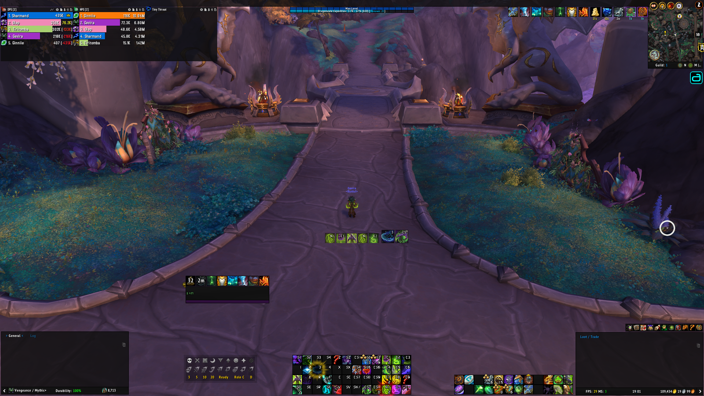
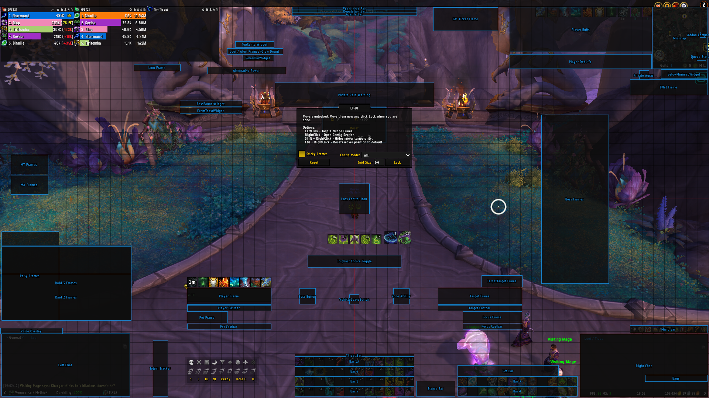

# XoneFobic's ElvUI Profile

My ElvUI profile is optimised around using an MMO style mouse.  
So it features 4 stacked bars, where most 'on demand' spells are keybound to the mouse and are mostly on the right side. With a shift modifier to reach an additional 12 locations.

# Preview




# Export

## Profile

```
!E1!nN1w3Tjoq4Fn5nN9WnBhN3mo2n(CIVCmK2TVqQaKJ1garbrCsEO)23zKaCWXXxY2UN8qBaPzg9nFZiPzWE6EUEoHebXNKLJplwLrjc8P1SqXkVPMxy5j8COpLsZy0Kakox(k(6BOpsJ8S9CwYteoSxOEt118CwXcP9ftipPM33Z5Nf0CXaECAevqdNLe9mQLG(KyeplgwmNb3Uy(WfdwmCIs)XjG4(Wm2QLYUW3pIMJVwIklnnevR4j8meq0ecibUABPpiugnTqqemEI0bFN1TPxuAp7tepKxassiPOT1RP93Nva7CpnHMrIq7eXVNLetZZj3l9pW8XkQTmo8fACoorilpnI884K8uAGyCYs(RgDWksgjqqZQgV2mliaIFghcn24ARxoWWKGvKeHCfOQN777NrFegaaQpxi4XZjjkn8jbpeMXtxscPb8ivSjZBQ2FP12cCR6N8REcSHGNQmaqeKLpG2Hui4lOPewMNZ8B6)9HlqIGlwWJK(9pliraQNsILXOYx3aEBfngZFKQsR)M7cclCcj7byaBswFWva05ypZ1D2KfJ)Y1UTUD8Csgnr061dEUvldTl8Cgg9yF770nRuPfmWwk0sRLUMUNJRCleSitWL)akyAaEiv03UjwERWvW5cJwD6558LjLw3D28nihFXSD3wNBaCSDXYL5BKAlNSEKZ1VWeua8SBagEugWPBu6MHJAQJCalJEGgADqEDclHftsTlGeHKxXS7BfTADUPUUKuVD0DJ4bf5n4QdWbD00AzyH6)imNlNKloeIB3fiftlaXZ5RPzaoha7hjmyB27XJNBQbEPE3UaQ45qstsdH336GS)W6dm3KjGM91Ef(UgWKgvuHlj7EQq9)NcJ0UxpmUJXd4SerWQ6WXre)nnG)1RDfg6NNZomHAcXW2DmR3yS)0CZUvcAul4BLcZzPr81LPu7icTVmkdmfEcliJ7V1wVdT9UhYBFbY7BM(2A74KUET)2E)(lmD)irvQ27NHz1bWTE7kRAEKHBlddjLUO(MTdMJzcrO(QBNoOSwAvaY6eauDc0C4(gAZiGmL5TAlhg3nBcx85axzU8vheUlM1OJoUo2th6EKjfTbX)6SXdgo46(UhdC0HecqhxE6ayg6XCoHbMByA2Ct8PS9TMcuSEN9NCHh)7Y5rcw6PKM3T9gaM8WXS)2Q3fQZ(UMc3NVR9uVRhzAO3YSt36uIT4JMR5wjdgBY)6Em(MbCaM8o6fS7xjGkDojUh0f3SsZ2(QVTJY64Tby60vu)DDZ6wBKQVC1cVeXcpAsEQ2rM3AI1VeWtaHfZHs)KLj6tUxwntEqgjDmmloiulgutdfQpsKxxGklj095uzXr)trYdvYwKtTJyV8cjlCqeLKuKQkrMuKrKww6zYYKzX0rqQ)ScreK9d7oVU)vZ(gIPIeboJNZS81KOWnY2CKVpdmfv4n9CDv1yfjmXsKJr7lRouUs4AdhjHvRuxTOEzTI6LvkQlzdc2gXRlQCNITIsIGIP3NmLGr5OYDRvabU6Or7esztLhOj7uIwtqeHGeSYLdPz3oAKtfl(wdSHt30uXgLhTO)KHQLbtdiVz1fQ(ZW2wKgjflvw(uzcLQ2zxVPqE8vSLlzbfrqb9L6cf9dxpuIk4pMkYVmgw2qIrJWkEIhlPOi(x)ycnKveJUaworUs0ycCh7befGzalbjESjnXd0NBUC12yZqBeBFqyonBbFTudzxPImsFPlQQ4r251owV9BCHKAU4drn7NnoD)ChOhtbO5ebKEjOZGEk5rH81jQteY69jg2a80)daV9LJDSOBh(OcWD)da4FN8z7p547JDcZ)dbC1XQH42M3l2pxDtWjJ(paAERlT9jCALGQZhcsFoiuWj(9d(FxzRXLnlQk8bjKRPyjKWvPAn8UQpRf(8duAkAKfyFxQQNaty8j2nXWG1NB89Xot7ZAvjlFpPx2W0psxXcIOdFIj(pw8sUGO(otBYKvAJFiQtZdAFKCLkU9XsRs5mCMnT9DWOx1(p))CXT362Y6NfQgTr)8EAc0fSAlFWk1psIG47qJObcEwZwtWpQKSVJ2vnECHK0WoJaTItR(nio76lpBYLN58RFaGMLdg6zLx0g)GaGpSMNfMdYn57tHwfoR1FZX2Xa)qyZFAopNj)LnC6Bp7RdVd)kh3nEQZ4Runv4D5LPz8LSi6LxEfDjbAn4F)
```

## Private (Character Specific)

```
!E1!L9ySUoimmu0)ONe6jXaJvQRDa6SRCc3cr4qIcUGkF9nb2AN815yNJmvr3PodpSuQyMncidPu3m7ruyf)qwMCZhpAe3(oN6pYdEoM5DzwewTeTJCITksLMnGj5Dl2YlSC(rrozh9ywBHpSI01tjxkmnee1f)2TocpOUE8KFj6HnLf5Hn4Jcuq3Q()V668Outtm5wZhWN)
```

# Table

## Profile

```lua
{
    ["actionbar"] = {
        ["bar1"] = {
            ["buttonSpacing"] = 0,
            ["countFont"] = "Continuum Medium",
            ["countFontSize"] = 12,
            ["hotkeyFont"] = "Continuum Medium",
            ["hotkeyFontSize"] = 12,
            ["macroFont"] = "Continuum Medium",
            ["macroFontSize"] = 12,
        },
        ["bar10"] = {
            ["countFont"] = "Continuum Medium",
            ["countFontSize"] = 12,
            ["hotkeyFont"] = "Continuum Medium",
            ["hotkeyFontSize"] = 12,
            ["macroFont"] = "Continuum Medium",
            ["macroFontSize"] = 12,
        },
        ["bar13"] = {
            ["buttonSpacing"] = 0,
            ["countFont"] = "Continuum Medium",
            ["countFontSize"] = 12,
            ["enabled"] = true,
            ["hotkeyFont"] = "Continuum Medium",
            ["hotkeyFontSize"] = 12,
            ["macroFont"] = "Continuum Medium",
            ["macroFontSize"] = 12,
        },
        ["bar14"] = {
            ["countFont"] = "Continuum Medium",
            ["countFontSize"] = 12,
            ["hotkeyFont"] = "Continuum Medium",
            ["hotkeyFontSize"] = 12,
            ["macroFont"] = "Continuum Medium",
            ["macroFontSize"] = 12,
        },
        ["bar15"] = {
            ["countFont"] = "Continuum Medium",
            ["countFontSize"] = 12,
            ["hotkeyFont"] = "Continuum Medium",
            ["hotkeyFontSize"] = 12,
            ["macroFont"] = "Continuum Medium",
            ["macroFontSize"] = 12,
        },
        ["bar2"] = {
            ["countFont"] = "Continuum Medium",
            ["countFontSize"] = 12,
            ["hotkeyFont"] = "Continuum Medium",
            ["hotkeyFontSize"] = 12,
            ["macroFont"] = "Continuum Medium",
            ["macroFontSize"] = 12,
        },
        ["bar3"] = {
            ["buttonSpacing"] = 0,
            ["buttons"] = 12,
            ["buttonsPerRow"] = 12,
            ["countFont"] = "Continuum Medium",
            ["countFontSize"] = 12,
            ["hotkeyFont"] = "Continuum Medium",
            ["hotkeyFontSize"] = 12,
            ["macroFont"] = "Continuum Medium",
            ["macroFontSize"] = 12,
        },
        ["bar4"] = {
            ["backdrop"] = false,
            ["buttonSpacing"] = 0,
            ["buttonsPerRow"] = 12,
            ["countFont"] = "Continuum Medium",
            ["countFontSize"] = 12,
            ["hotkeyFont"] = "Continuum Medium",
            ["hotkeyFontSize"] = 12,
            ["macroFont"] = "Continuum Medium",
            ["macroFontSize"] = 12,
            ["point"] = "BOTTOMLEFT",
        },
        ["bar5"] = {
            ["buttonSpacing"] = 0,
            ["buttons"] = 12,
            ["buttonsPerRow"] = 12,
            ["countFont"] = "Continuum Medium",
            ["countFontSize"] = 12,
            ["hotkeyFont"] = "Continuum Medium",
            ["hotkeyFontSize"] = 12,
            ["macroFont"] = "Continuum Medium",
            ["macroFontSize"] = 12,
        },
        ["bar6"] = {
            ["buttonSpacing"] = 0,
            ["countFont"] = "Continuum Medium",
            ["countFontSize"] = 12,
            ["enabled"] = true,
            ["hotkeyFont"] = "Continuum Medium",
            ["hotkeyFontSize"] = 12,
            ["macroFont"] = "Continuum Medium",
            ["macroFontSize"] = 12,
        },
        ["bar7"] = {
            ["countFont"] = "Continuum Medium",
            ["countFontSize"] = 12,
            ["hotkeyFont"] = "Continuum Medium",
            ["hotkeyFontSize"] = 12,
            ["macroFont"] = "Continuum Medium",
            ["macroFontSize"] = 12,
        },
        ["bar8"] = {
            ["countFont"] = "Continuum Medium",
            ["countFontSize"] = 12,
            ["hotkeyFont"] = "Continuum Medium",
            ["hotkeyFontSize"] = 12,
            ["macroFont"] = "Continuum Medium",
            ["macroFontSize"] = 12,
        },
        ["bar9"] = {
            ["countFont"] = "Continuum Medium",
            ["countFontSize"] = 12,
            ["hotkeyFont"] = "Continuum Medium",
            ["hotkeyFontSize"] = 12,
            ["macroFont"] = "Continuum Medium",
            ["macroFontSize"] = 12,
        },
        ["barPet"] = {
            ["buttonSpacing"] = 0,
            ["buttonsPerRow"] = 10,
            ["countFont"] = "Continuum Medium",
            ["countFontSize"] = 12,
            ["hotkeyFont"] = "Continuum Medium",
            ["hotkeyFontSize"] = 12,
        },
        ["desaturateOnCooldown"] = true,
        ["extraActionButton"] = {
            ["hotkeyFont"] = "Continuum Medium",
            ["hotkeyFontSize"] = 12,
        },
        ["font"] = "Continuum Medium",
        ["fontSize"] = 12,
        ["microbar"] = {
            ["backdrop"] = true,
            ["buttonHeight"] = 20,
            ["enabled"] = true,
            ["keepSizeRatio"] = true,
        },
        ["stanceBar"] = {
            ["buttonSize"] = 24,
            ["buttonSpacing"] = 0,
            ["buttonsPerRow"] = 5,
            ["hotkeyFont"] = "Continuum Medium",
            ["hotkeyFontSize"] = 12,
        },
        ["vehicleExitButton"] = {
            ["hotkeyFont"] = "Continuum Medium",
            ["hotkeyFontSize"] = 12,
        },
    },
    ["auras"] = {
        ["buffs"] = {
            ["countFont"] = "Oswald",
            ["timeFont"] = "Oswald",
            ["timeFontOutline"] = "SHADOW",
            ["timeYOffset"] = -1,
        },
    },
    ["bags"] = {
        ["junkIcon"] = true,
        ["reverseSlots"] = true,
        ["scrapIcon"] = true,
        ["showBindType"] = true,
        ["useBlizzardCleanup"] = true,
    },
    ["chat"] = {
        ["editBoxPosition"] = "ABOVE_CHAT_INSIDE",
        ["historySize"] = 500,
        ["keywords"] = "%MYNAME%,Xone",
        ["tabSelectorColor"] = {
            ["b"] = 0.82,
            ["g"] = 0.51,
            ["r"] = 0.09,
        },
        ["timeStampFormat"] = "%H:%M:%S ",
    },
    ["convertPages"] = true,
    ["databars"] = {
        ["azerite"] = {
            ["fontSize"] = 10,
            ["hideInCombat"] = true,
            ["showBubbles"] = true,
            ["width"] = 400,
        },
        ["experience"] = {
            ["fontSize"] = 10,
            ["hideAtMaxLevel"] = false,
            ["hideInCombat"] = true,
            ["questCompletedOnly"] = true,
            ["showBubbles"] = true,
            ["showLevel"] = true,
            ["textFormat"] = "CURPERCREM",
            ["width"] = 400,
        },
        ["honor"] = {
            ["enable"] = false,
            ["hideInCombat"] = true,
        },
        ["reputation"] = {
            ["enable"] = true,
            ["fontSize"] = 10,
            ["hideInCombat"] = true,
            ["showBubbles"] = true,
            ["textFormat"] = "CURPERCREM",
            ["width"] = 400,
        },
        ["threat"] = {
            ["width"] = 384,
        },
    },
    ["datatexts"] = {
        ["panels"] = {
            ["MinimapPanel"] = {
                [2] = "Difficulty",
            },
        },
    },
    ["general"] = {
        ["afk"] = false,
        ["autoRepair"] = "PLAYER",
        ["backdropfadecolor"] = {
            ["b"] = 0.054,
            ["g"] = 0.054,
            ["r"] = 0.054,
        },
        ["bottomPanel"] = false,
        ["itemLevel"] = {
            ["displayCharacterInfo"] = false,
            ["displayInspectInfo"] = false,
            ["enchantAbbrev"] = false,
            ["itemLevelRarity"] = false,
            ["showEnchants"] = false,
            ["showGems"] = false,
            ["showItemLevel"] = false,
        },
        ["loginmessage"] = false,
        ["lootRoll"] = {
            ["qualityItemLevel"] = true,
            ["qualityName"] = true,
        },
        ["topPanel"] = true,
    },
    ["movers"] = {
        ["AlertFrameMover"] = "TOP,UIParent,TOP,-319,-155",
        ["AltPowerBarMover"] = "TOP,UIParent,TOP,-346,-215",
        ["AzeriteBarMover"] = "TOP,ElvUIParent,TOP,0,-40",
        ["BNETMover"] = "TOPRIGHT,UIParent,TOPRIGHT,-4,-255",
        ["BelowMinimapContainerMover"] = "TOPRIGHT,UIParent,TOPRIGHT,-4,-223",
        ["BossBannerMover"] = "TOPLEFT,UIParent,TOPLEFT,577,-324",
        ["BossHeaderMover"] = "BOTTOMRIGHT,ElvUIParent,BOTTOMRIGHT,-321,367",
        ["BuffsMover"] = "TOPRIGHT,UIParent,TOPRIGHT,-183,-23",
        ["DebuffsMover"] = "TOPRIGHT,ElvUIParent,TOPRIGHT,-184,-174",
        ["ElvAB_1"] = "BOTTOM,ElvUIParent,BOTTOM,0,37",
        ["ElvAB_13"] = "BOTTOM,ElvUIParent,BOTTOM,0,101",
        ["ElvAB_2"] = "BOTTOM,UIParent,BOTTOM,0,4",
        ["ElvAB_3"] = "BOTTOMRIGHT,ElvUIParent,BOTTOMRIGHT,-422,37",
        ["ElvAB_4"] = "BOTTOMRIGHT,ElvUIParent,BOTTOMRIGHT,-422,5",
        ["ElvAB_5"] = "BOTTOM,ElvUIParent,BOTTOM,0,5",
        ["ElvAB_6"] = "BOTTOM,ElvUIParent,BOTTOM,0,69",
        ["ElvAB_7"] = "BOTTOMRIGHT,UIParent,BOTTOMRIGHT,-232,208",
        ["ElvUF_AssistMover"] = "TOPLEFT,UIParent,TOPLEFT,34,-563",
        ["ElvUF_FocusMover"] = "BOTTOMRIGHT,ElvUIParent,BOTTOMRIGHT,-600,241",
        ["ElvUF_PetMover"] = "BOTTOMLEFT,UIParent,BOTTOMLEFT,600,240",
        ["ElvUF_PlayerMover"] = "BOTTOMLEFT,ElvUIParent,BOTTOMLEFT,600,300",
        ["ElvUF_TankMover"] = "TOPLEFT,UIParent,TOPLEFT,34,-498",
        ["ElvUF_TargetMover"] = "BOTTOMRIGHT,ElvUIParent,BOTTOMRIGHT,-600,300",
        ["ElvUF_TargetTargetMover"] = "BOTTOMRIGHT,ElvUIParent,BOTTOMRIGHT,-599,357",
        ["EventToastMover"] = "TOPLEFT,UIParent,TOPLEFT,577,-346",
        ["ExperienceBarMover"] = "TOP,ElvUIParent,TOP,0,-22",
        ["GMMover"] = "TOP,UIParent,TOP,357,-24",
        ["LootFrameMover"] = "TOPLEFT,UIParent,TOPLEFT,429,-206",
        ["MicrobarMover"] = "BOTTOMRIGHT,UIParent,BOTTOMRIGHT,-4,209",
        ["MinimapMover"] = "TOPRIGHT,UIParent,TOPRIGHT,-4,-23",
        ["PetAB"] = "BOTTOMRIGHT,ElvUIParent,BOTTOMRIGHT,-482,69",
        ["PowerBarContainerMover"] = "TOP,UIParent,TOP,-309,-177",
        ["ReputationBarMover"] = "TOP,ElvUIParent,TOP,0,-31",
        ["RightChatMover"] = "BOTTOMRIGHT,ElvUIParent,BOTTOMRIGHT,-2,2",
        ["ShiftAB"] = "BOTTOM,ElvUIParent,BOTTOM,261,5",
        ["ThreatBarMover"] = "BOTTOM,ElvUIParent,BOTTOM,0,132",
        ["TooltipMover"] = "BOTTOMRIGHT,UIParent,BOTTOMRIGHT,-4,275",
        ["TopCenterContainerMover"] = "TOP,UIParent,TOP,-320,-133",
        ["VOICECHAT"] = "BOTTOMLEFT,ElvUIParent,BOTTOMLEFT,1,205",
        ["WTGameBarAnchor"] = "TOP,UIParent,TOP,0,-113",
        ["WTMinimapButtonBarAnchor"] = "TOPRIGHT,UIParent,TOPRIGHT,-4,-311",
        ["WTRaidMarkersBarAnchor"] = "BOTTOMRIGHT,UIParent,BOTTOMRIGHT,-4,208",
        ["WTSwitchButtonBarMover"] = "TOPRIGHT,UIParent,TOPRIGHT,-32,-395",
    },
    ["tooltip"] = {
        ["gender"] = true,
    },
    ["unitframe"] = {
        ["colors"] = {
            ["auraBarBuff"] = {
                ["b"] = 0.1,
                ["g"] = 0.1,
                ["r"] = 0.1,
            },
            ["castColor"] = {
                ["b"] = 0.1,
                ["g"] = 0.1,
                ["r"] = 0.1,
            },
            ["health"] = {
                ["b"] = 0.1,
                ["g"] = 0.1,
                ["r"] = 0.1,
            },
        },
        ["units"] = {
            ["arena"] = {
                ["enable"] = false,
            },
            ["player"] = {
                ["aurabar"] = {
                    ["enable"] = false,
                },
                ["buffs"] = {
                    ["attachTo"] = "FRAME",
                    ["enable"] = true,
                },
                ["debuffs"] = {
                    ["attachTo"] = "BUFFS",
                },
            },
            ["target"] = {
                ["aurabar"] = {
                    ["enable"] = false,
                },
            },
        },
    },
}::profile::Default
```

## Private (Character Settings)

```lua
{
    ["bags"] = {
        ["enable"] = false,
    },
    ["install_complete"] = 13.66,
    ["nameplates"] = {
        ["enable"] = false,
    },
    ["skins"] = {
        ["blizzard"] = {
            ["bgmap"] = false,
            ["character"] = false,
            ["inspect"] = false,
            ["weeklyRewards"] = false,
        },
        ["parchmentRemoverEnable"] = true,
    },
    ["theme"] = "default",
    ["tooltip"] = {
        ["enable"] = false,
    },
}::private
```